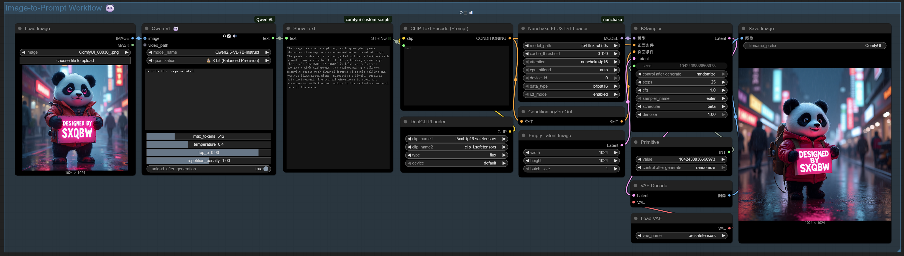
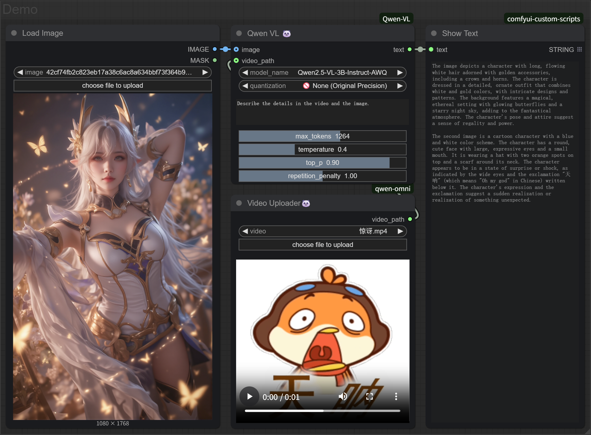
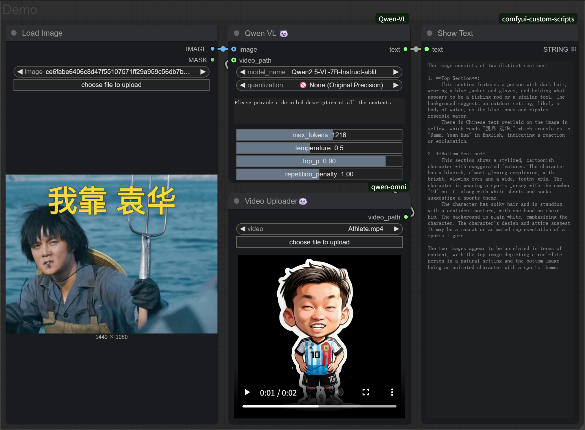

<div align="center">

# ComfyUI-Qwen-VL 🐼
<p align="center">
        <a href="README.md">English</a> &nbsp｜ &nbsp 中文
</p>

**当Figma遇上VSCode，艺术思维碰撞工程逻辑 —— 这是设计师向代码世界发出的浪漫宣言。**  
✨ Qwen2.5-VL系列大语言模型的ComfyUI扩展，支持文本生成、图像理解、视频分析等多模态功能。 ✨
  
[](https://github.com/SXQBW/ComfyUI-Qwen-VL/stargazers)
[](https://huggingface.co/Qwen)
</div>
<div align="center">
  
</div>

---

### 🌟 特点

- 支持Qwen2-VL、Qwen2.5-VL等系列模型
- 提供文本生成、图像理解、视频分析等多种功能节点
- 支持模型量化配置，优化内存使用
- 提供直观的用户界面，便于参数调整

### 🚀 安装

1. 打开ComfyUI的custom_nodes目录
2. 克隆此仓库：
   ```bash
   git clone https://github.com/SXQBW/ComfyUI-Qwen-VL.git
   ```
3. 安装依赖：
   ```bash
   cd ComfyUI-Qwen-VL
   pip install -r requirements.txt
   ```
4. 重启ComfyUI

### 📖 使用方法

1. 在ComfyUI界面中，找到Qwen-VL相关节点
2. 选择要使用的模型和量化方式
3. 配置生成参数，如温度、最大令牌数等
4. 连接输入（文本、图像或视频）和输出节点
5. 运行工作流

### 📦 模型支持

目前支持以下模型：

- Qwen/Qwen2.5-VL-3B-Instruct
- Qwen/Qwen2.5-VL-3B-Instruct-AWQ
- Qwen/Qwen2.5-VL-7B-Instruct
- Qwen/Qwen2.5-VL-7B-Instruct-AWQ
- Qwen/Qwen2.5-VL-32B-Instruct
- Qwen/Qwen2.5-VL-32B-Instruct-AWQ
- Qwen/Qwen2.5-VL-72B-Instruct
- Qwen/Qwen2.5-VL-72B-Instruct-AWQ
- Qwen/Qwen2-VL-2B
- Qwen/Qwen2-VL-2B-Instruct
- Qwen/Qwen2-VL-7B-Instruct
- Qwen/Qwen2-VL-72B-Instruct
- Qwen/Qwen2-VL-2B-Instruct-AWQ
- Qwen/Qwen2-VL-2B-Instruct-GPTQ-Int4
- Qwen/Qwen2-VL-2B-Instruct-GPTQ-Int8
- Qwen/Qwen2-VL-7B-Instruct-AWQ
- Qwen/Qwen2-VL-7B-Instruct-GPTQ-Int4
- Qwen/Qwen2-VL-7B-Instruct-GPTQ-Int8
- Qwen/Qwen2-VL-72B-Instruct-AWQ
- Qwen/Qwen2-VL-72B-Instruct-GPTQ-Int4
- Qwen/Qwen2-VL-72B-Instruct-GPTQ-Int8
- huihui-ai/Qwen2.5-VL-7B-Instruct-abliterated

### 量化选项

- 🚫 None (Original Precision): 使用原始精度
- 👍 4-bit (VRAM-friendly): 使用4位量化，节省显存
- ⚖️ 8-bit (Balanced Precision): 使用8位量化，平衡精度和性能

### 👀 示例工作流

以下是一个简单的图像理解工作流示例：






### 📖 常见问题

#### 模型加载问题

如果遇到模型加载错误，请确保：

1. 模型文件路径正确
2. 有足够的GPU内存（请根据显存的大小选择合适模型，别上来就直奔72B模型，大力出不了奇迹，只会爆显存）
3. 已安装所有必要依赖

#### 关于量化

当使用预量化模型（如AWQ版本）时，可能会看到以下警告：模型Qwen2.5-VL-3B-Instruct-AWQ已经是量化模型，将忽略用户的量化设置这是正常现象，插件会自动使用模型的预量化版本。

### 🤝 贡献

欢迎贡献代码、报告问题或提出建议！

### 🙏 致谢

感谢Qwen团队开发的强大模型，以及ComfyUI社区的支持！

**此刻，你指尖的星星✨**  
不仅是认可，更是设计思维与代码世界碰撞的宇宙大爆炸。当艺术生的美学执念遇上程序员的极客精神——这可能是GitHub上最浪漫的化学反应。

[点击Star见证跨界革命](https://github.com/SXQBW/ComfyUI-Qwen-VL)
